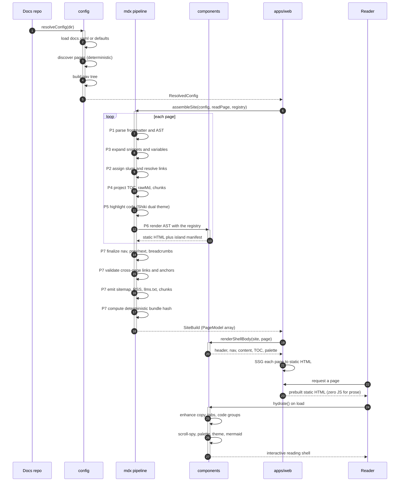
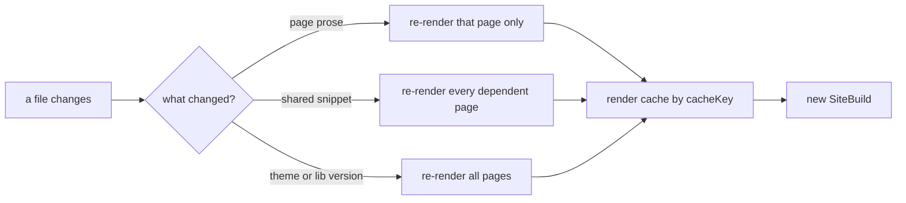

# Architecture

Readsmith is a precompiled-bundle system. The `@readsmith/*` packages compile a folder of Markdown or MDX into an immutable build, and the serving app (Next.js) serves those prebuilt pages and hydrates the interactive islands. The compiler is the packages; Next is only the shell.

<Info title="Big diagram ahead">
The sequence below is intentionally large. Drag to pan, scroll or use the buttons to zoom, and open it fullscreen with the corners button for a dedicated view.
</Info>

## The build lifecycle

## Incremental rebuilds

On a change, only the affected pages re-render. The P6 render cache key is a content hash over the page source, the resolved variable scope, the theme, the library version, and the content hashes of exactly the snippets that page used. A changed snippet invalidates every dependent page and nothing else.

