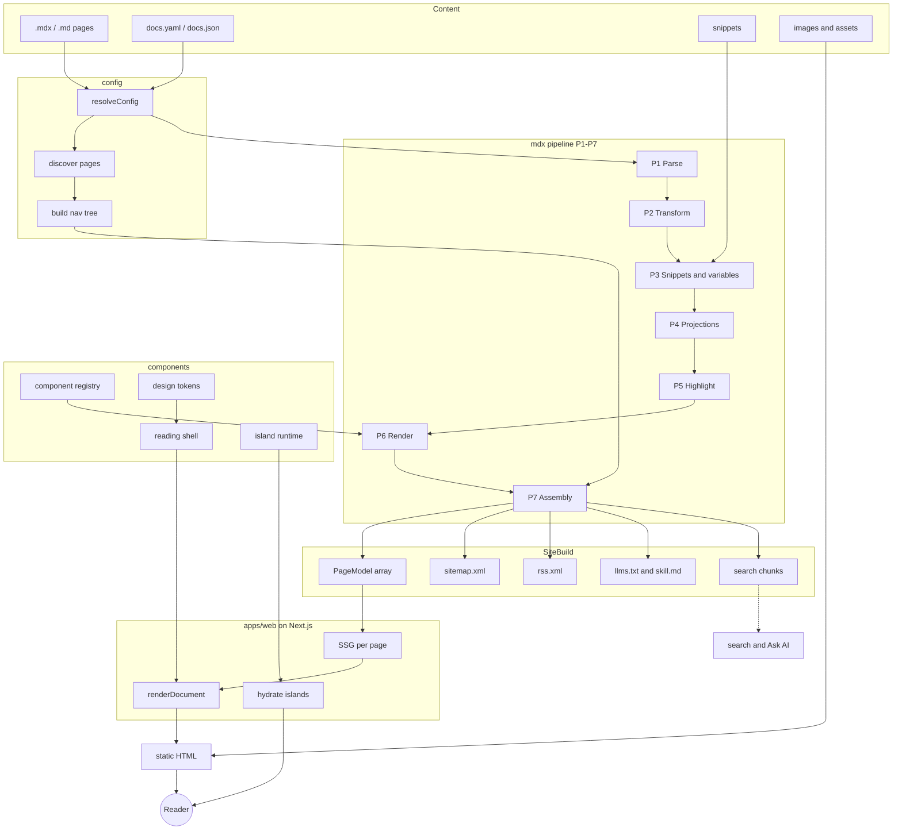

# Usage

Write Markdown or MDX. Components like callouts, tabs, and cards are available in `.mdx` files. Variables and snippets resolve at build time, so pages ship as static HTML.

<Note>Static prose ships zero JavaScript. Only interactive components (tabs, code groups) hydrate as islands.</Note>

## Code groups

A code group switches between samples. It syncs page-wide with tabs that share a group.

<CodeGroup group="lang">

```python
print("hello from readsmith")
```

```javascript
console.log("hello from readsmith");
```

</CodeGroup>

## Diagrams

A fenced `mermaid` block renders as a diagram (themed to light and dark, lazy-loaded only on pages that use one). Large diagrams get pan, zoom, and a fullscreen view, drag to pan, scroll or use the buttons to zoom, and the corners button opens it fullscreen.


