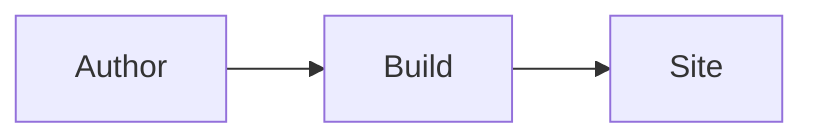
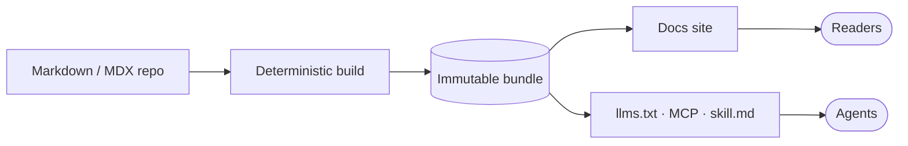

# Diagrams

A fenced code block with the `mermaid` language renders as a diagram instead of highlighted code. It works in plain `.md` and `.mdx` alike, and the whole [Mermaid](https://mermaid.js.org) grammar is available: flowcharts, sequence diagrams, state machines, ER diagrams, Gantt charts, and the rest.

## Write a fence, get a diagram

````md

````

This is the pipeline that built the page you are reading:



The rendered diagram is interactive: drag to pan, zoom with the wheel or the controls, open it fullscreen. The reading behavior is documented in the gallery, at [Diagrams in the component library](/components/diagrams).

## When a diagram beats an image

A Mermaid diagram is text: it diffs in review, updates without a design tool, and restyles itself when your site's theme changes. Reach for an [image in a Frame](/components/frames) instead when the visual is not a graph: screenshots, photography, hand-drawn art.

<Tip>
Before the renderer runs (and if a diagram fails to parse), the fence shows its raw source in monospace, so a broken diagram degrades to something a reader can still use, and you can see exactly what to fix.
</Tip>
