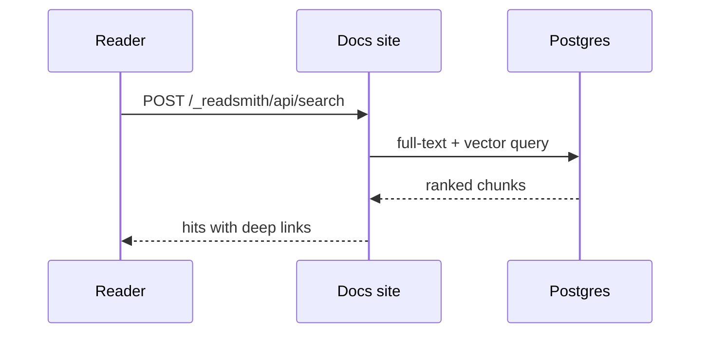
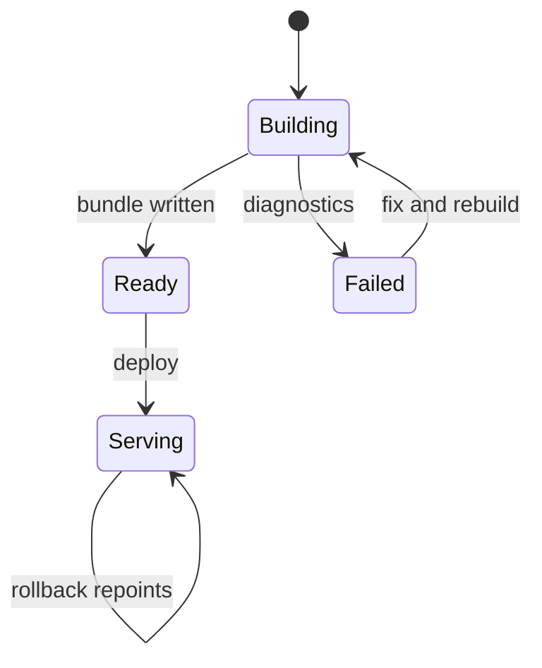

# Diagrams

Diagrams are authored as a plain ` ```mermaid ` fence, no component required; the syntax lives in [Authoring, Diagrams](/authoring/diagrams). This page shows how the rendered result behaves.

## Try one

Drag to pan, scroll or use the controls to zoom, and the last control opens the diagram fullscreen. Press <Kbd>Esc</Kbd> to close it.



## A second grammar

The same fence renders every Mermaid type. A state machine:



## How it behaves

- **Themed to your site.** Diagram colors derive from the live design tokens, not Mermaid's palette, and diagrams re-render when the reader toggles light and dark.
- **Lazy by design.** The Mermaid renderer loads only on pages that contain a diagram, in its own chunk. Prose pages keep shipping zero JavaScript.
- **Readable at any size.** Diagrams are vectors: zooming re-renders crisply, and large diagrams get a fullscreen view with its own pan and zoom.
- **Safe by default.** Diagram source renders with Mermaid's strict security level; script-bearing input is refused.
