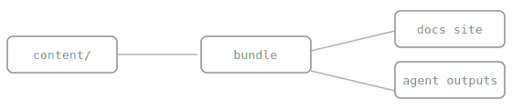

# Frames

A `Frame` gives images and embeds consistent presentation: a quiet border, breathing room, and an optional caption. Its best trick is invisible: a declared `ratio` reserves the space before the media loads, so the page cannot shift.

## A framed diagram

<Frame caption="One build, two audiences: the same bundle serves pages to people and projections to agents." ratio="560/120">
  
</Frame>

The image above is a co-located asset: it lives next to this page's source file and is published automatically, no mount required.

## Usage

```mdx
<Frame caption="The dashboard after a successful deploy." ratio="16/9">
  
</Frame>
```

## Props

| Prop | Type | Effect |
| --- | --- | --- |
| `caption` | string | A caption below the media, set in the metadata style |
| `ratio` | string | An aspect ratio like `16/9`; reserves the space before load, so zero layout shift |

<Tip>
Declare `ratio` for anything that loads: screenshots, videos, embeds. The reading experience budget says layout shift is near zero; frames are where images would otherwise spend it.
</Tip>
